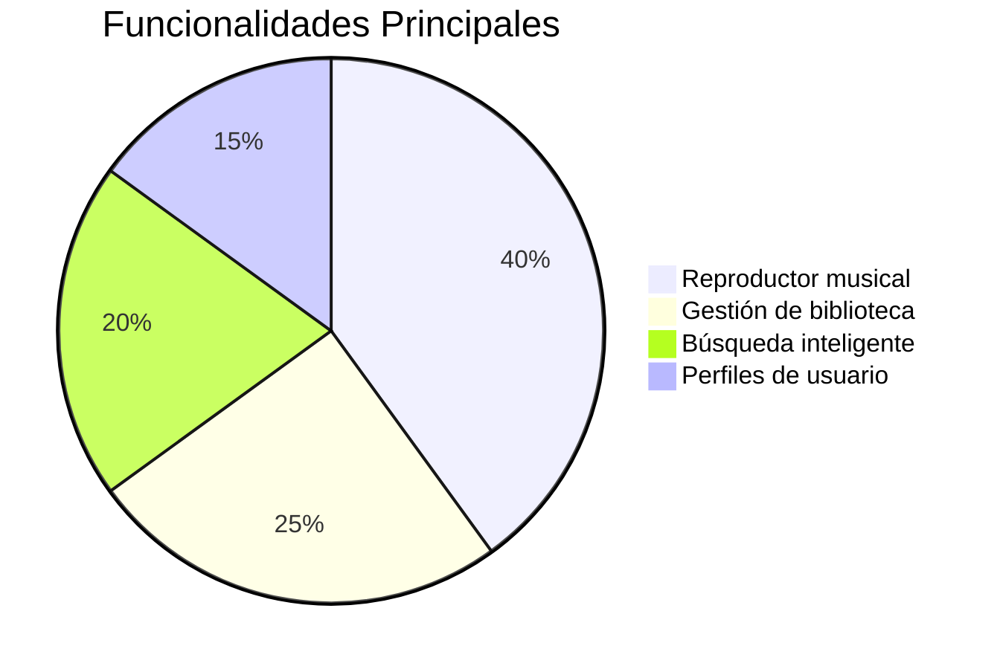

# 🎵 MiMusic - Tu Plataforma Musical (Proyecto Final - Desarrollo Web en Entorno Servidor)


**¡Hola! 👋 Soy Pablo de la Sierra**, y este es mi proyecto final de **Desarrollo Web en Entorno Servidor**: **MiMusic**, un clon de Spotify con funcionalidades básicas desarrollado con tecnologías modernas.

## 🌟 Visión del Proyecto
MiMusic es una plataforma de streaming musical que permite:
> "Explorar, descubrir y disfrutar de tu música favorita como en Spotify, pero con tu toque personal"

**Características principales**:
- 🎧 Reproductor de audio con controles básicos (play/pause, volumen, progreso)
- 📂 Gestión de biblioteca musical
- 🔍 Búsqueda de canciones y artistas
- 📱 Diseño responsive (adaptable a móviles)

## 🛠 Stack Tecnológico

### Frontend
 


### Backend
 


### APIs Externas
- Spotify Web API (para datos de canciones)
- JWT (autenticación segura)

## 🎨 Características Clave



### 1. Reproductor Musical
- Controles de reproducción básicos
- Barra de progreso interactiva
- Volumen ajustable
- Información del artista/álbum

### 2. Gestión de Biblioteca
- Creación/eliminación de playlists
- Favoritos
- Historial de reproducción

### 3. Búsqueda
- Búsqueda por: canción, artista, álbum
- Resultados en tiempo real
- Sugerencias automáticas

## � Estructura del Proyecto

```
📦 Proyecto-MiMusic
├── 📂 client/            # Frontend React
│   ├── src/
│   │   ├── components/  # Componentes reutilizables
│   │   ├── pages/       # Vistas principales
│   │   ├── hooks/       # Custom hooks
│   │   └── utils/       # Utilidades
│
├── 📂 server/           # Backend Node.js
│   ├── controllers/     # Lógica de endpoints
│   ├── models/          # Modelos de MongoDB
│   ├── routes/          # Rutas API
│   └── middleware/      # Autenticación
│
├── 📂 docs/             # Documentación
└── 📜 README.md         # Este archivo
```

## 🚀 Instalación Local

### Requisitos previos
- Node.js 18+
- MongoDB
- Cuenta de desarrollador Spotify (para API)

### Pasos:
```bash
# 1. Clonar repositorio
git clone https://github.com/PaabloJ7/Proyecto-MiMusic.git
cd Proyecto-MiMusic

# 2. Configurar backend
cd server
cp .env.example .env
# Editar .env con tus credenciales
npm install

# 3. Configurar frontend
cd ../client
npm install

# 4. Iniciar servidores
# En una terminal:
cd ../server && npm start
# En otra terminal:
cd ../client && npm run dev
```

## 🔍 Capturas de Pantalla


## 📌 Roadmap Futuro
- [ ] Integración completa con Spotify API
- [ ] Sistema de recomendaciones
- [ ] Modo oscuro/claro
- [ ] Compartir playlists

## 📬 Contacto
**Autor**: Pablo de la Sierra  
📧 pablo.delasierra@example.com  
🔗 [GitHub](https://github.com/PaabloJ7)

---

"La música es el lenguaje universal" - MiMusic 2025
```


¿Necesitas que añada alguna sección adicional? Por ejemplo:
- Detalles técnicos de la integración con Spotify API
- Explicación del sistema de autenticación JWT
- Guía para contribuciones
