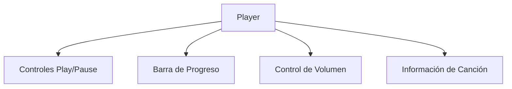

Aquí tienes el README.md adaptado para tu proyecto MiMusic con React (sin Tailwind) y MySQL:

```markdown
# 🎵 MiMusic - Plataforma Musical con React y MySQL


**Proyecto Final de Desarrollo Web en Entorno Servidor**  
**Autor**: Pablo de la Sierra

## 🌟 Visión del Proyecto
MiMusic replica las funcionalidades básicas de Spotify con:
- 🎵 Reproductor musical personalizado
- 📚 Gestión de biblioteca personal
- 🔍 Motor de búsqueda de canciones
- 👤 Sistema de usuarios y perfiles

## 🛠 Tecnologías Utilizadas

### Frontend


  <!-- Sin Tailwind -->

### Backend


  <!-- MySQL en lugar de MongoDB -->

### Autenticación


## 🎨 Características Principales

### 1. Reproductor Musical Avanzado


### 2. Gestión de Contenido
- Creación y edición de playlists
- Sistema de favoritos
- Historial de reproducción
- Clasificación por géneros

### 3. Búsqueda Inteligente
- Filtrado por: canciones, artistas, álbumes
- Resultados en tiempo real
- Búsqueda por letras

## � Estructura del Proyecto

```
📦 Proyecto-MiMusic
├── 📂 client/              # Frontend React
│   ├── src/
│   │   ├── assets/        # Imágenes y estilos
│   │   ├── components/    # Componentes reutilizables
│   │   ├── scss/          # Estilos con Sass  <!-- Sin Tailwind -->
│   │   └── services/      # Conexión con API
│
├── 📂 server/             # Backend Node.js
│   ├── config/
│   │   └── database.js    # Configuración MySQL
│   ├── models/            # Modelos de datos
│   ├── routes/            # Endpoints API
│   └── utils/             # Utilidades
│
├── 📂 database/           # Scripts MySQL
│   ├── schema.sql         # Esquema de base de datos
│   └── seeds.sql          # Datos iniciales
└── 📜 README.md
```

## 🚀 Instalación y Configuración

### Requisitos
- Node.js 18+
- MySQL 8.0+
- Navegador moderno

### Pasos de instalación:

1. **Clonar repositorio**
```bash
git clone https://github.com/PaabloJ7/Proyecto-MiMusic.git
cd Proyecto-MiMusic
```

2. **Configurar base de datos MySQL**
```bash
mysql -u root -p < database/schema.sql
mysql -u root -p < database/seeds.sql
```

3. **Configurar backend**
```bash
cd server
cp .env.example .env
# Editar .env con tus credenciales de MySQL
npm install
```

4. **Configurar frontend**
```bash
cd ../client
npm install
```

5. **Iniciar aplicación**
```bash
# En una terminal (backend):
cd ../server && npm start

# En otra terminal (frontend):
cd ../client && npm run dev
```

## 🔍 Capturas de Pantalla


## 📌 Próximas Mejoras
- [x] Base de datos MySQL implementada
- [ ] Integración con API de Spotify
- [ ] Sistema de recomendaciones
- [ ] Subida de canciones propias

## 📬 Contacto
**Autor**: Pablo de la Sierra  
📧 pablo.delasierra@example.com  
🔗 [GitHub](https://github.com/PaabloJ7)

---

"Donde tu música cobra vida" - MiMusic 2024
```
